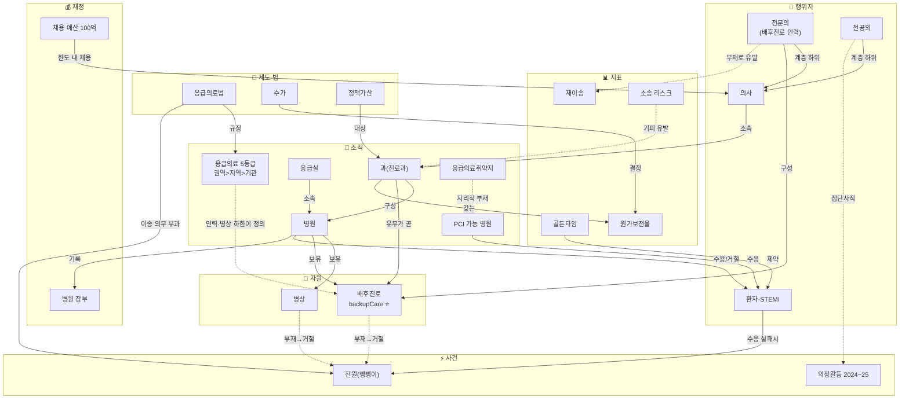
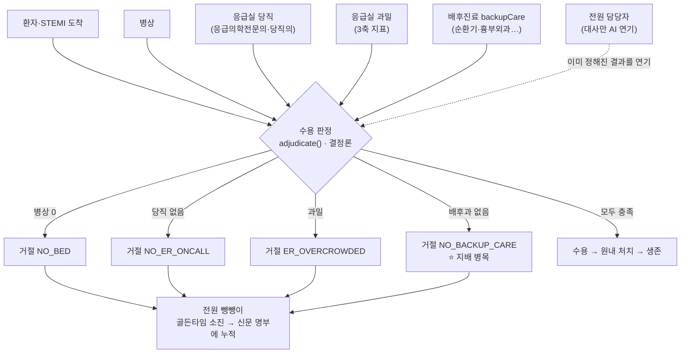
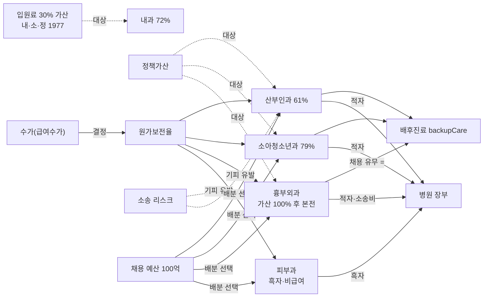

---
tags:
  - type/game-concept
---

# 리서치 — 의료 시스템 도메인 엔티티 관계 그래프

> **목적**: [domain-entities.md](domain-entities.md)의 엔티티들이 **어떻게 연결돼 시스템 문제를 만드는지**를 다이어그램으로 본다. 엔티티 목록이 '명사'라면 이 문서는 그 사이의 '동사'(소속·수용/거절·부재→거절·기피 유발)다. mermaid라 GitHub·옵시디언에서 그대로 렌더된다.
> **관련**: [domain-entities.md](domain-entities.md)(카탈로그·문제→엔티티 역인덱스) · [domain-entities-detail.md](domain-entities-detail.md)(엔티티별 관계 전체) · [game-concept.md](game-concept.md) · [current-korea-starting-world.md](../research/current-korea-starting-world.md)
>
> 관계선은 전부 검증된 엔티티 관계에서 왔다. 가독성을 위해 **핵심 노드만** 그렸다 — 전체 109개 엔티티의 관계는 [domain-entities-detail.md](domain-entities-detail.md)에 있다.

---

## 1. 핵심 관계 그래프 — 행위자 → 조직 → 자원, 제도가 규칙을 부과

시스템의 등뼈: **사람(의사·환자)** 이 **조직(병원·과)** 에 묶이고, 조직이 **자원(병상·배후진료)** 을 쥐며, 그 자원의 유무가 **환자의 생사**를 가른다. **제도·법**이 이 관계에 규칙을, **사건**이 충격을 준다.

---

## 2. 전원 수용 판정 — 4개 자원이 거절 사유로 (게임 코어)

수용/거절은 **LLM이 아니라 결정론 코드(`adjudicate()`)**가 4개 숨은 제약을 읽어 확정한다. 그중 **배후진료 부재(NO_BACKUP_CARE)가 지배 병목**이다 — 병상이 비어 있어도 살릴 과가 없으면 못 받는다.

---

## 3. 필수의료 경제 — 제로섬과 채용 딜레마 (병원 장부의 논지)

**수가**가 **원가보전율**을 정하고, 필수과는 원가 이하라 적자다. **정책가산**을 얹어도(흉부외과는 100% 가산 후에야 겨우 본전) 채용은 안 는다 — **소송 리스크**와 미용 대비 **상대유인**이 인력을 딴 데로 보낸다. 위저드의 **채용 예산**이 이 제로섬을 플레이어의 손에 쥐여준다.

> ⚠️ **수치 주의**: 그래프의 %는 원 리서치 문서 인용값이다(흉부외과 100%는 **가산 100% 포함** 후 원가 100% — fee-schedule §3, 가산 빼면 절반). 내과의 가산은 **입원료 30% 가산**이지 처치·수술 정책가산이 아니다(검증 교정 §2). 절대치는 게임에서 각색하고 **부호·대소만** 근거로 쓴다.

---

## 범례

- **실선 `-->`**: 구조적 소속·구성·보유·판정(강한 결합).
- **점선 `-.->`**: 유발·영향·규칙 부과(약한/인과 결합).
- **⭐ 배후진료(backupCare)**: 세 다이어그램에 공통으로 등장하는 **지배 병목** — 뺑뺑이·필수의료·게임 판정이 전부 이 노드로 수렴한다.
- 노드는 [domain-entities.md](domain-entities.md)의 엔티티명과 1:1 대응한다.
