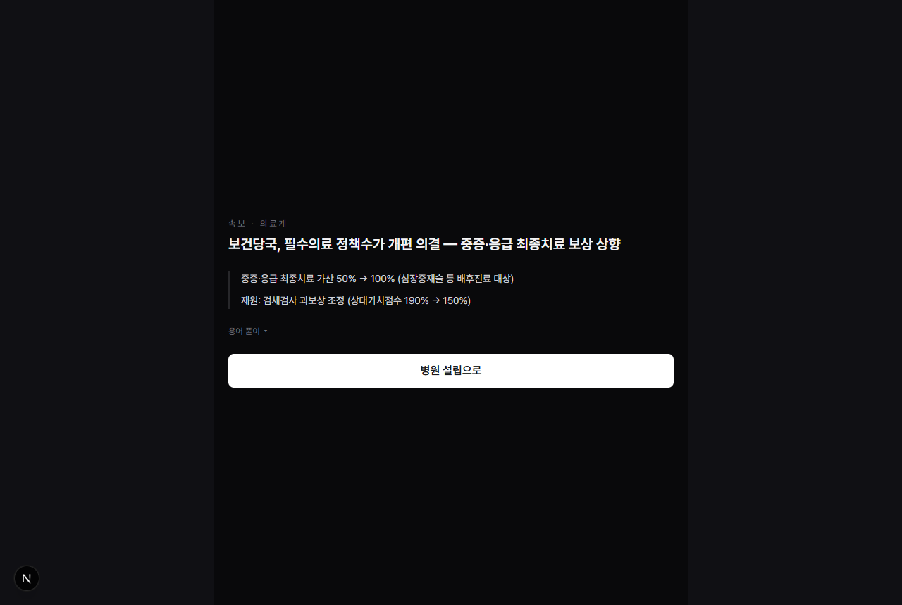
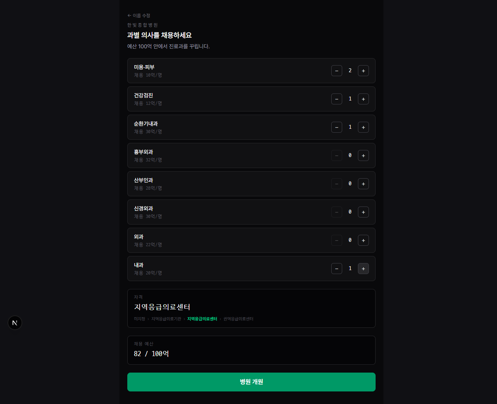
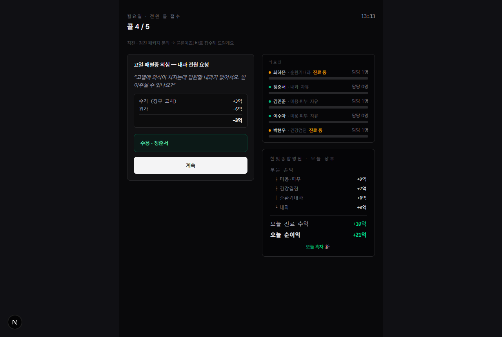
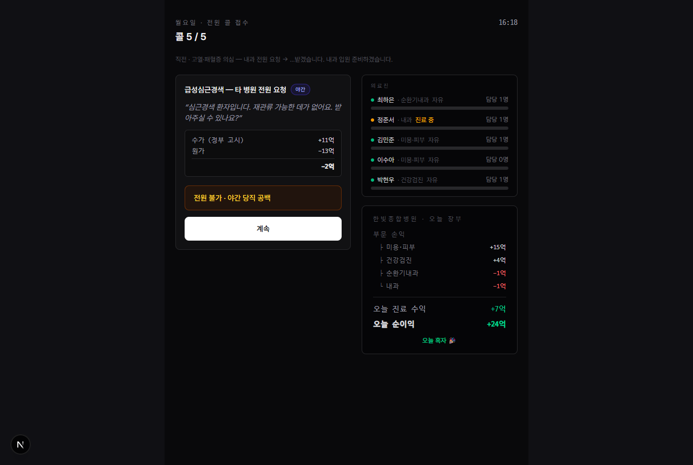
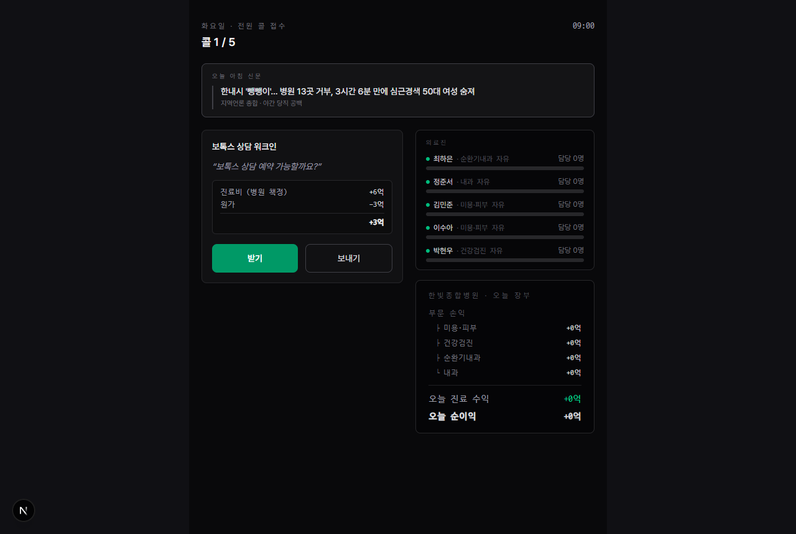
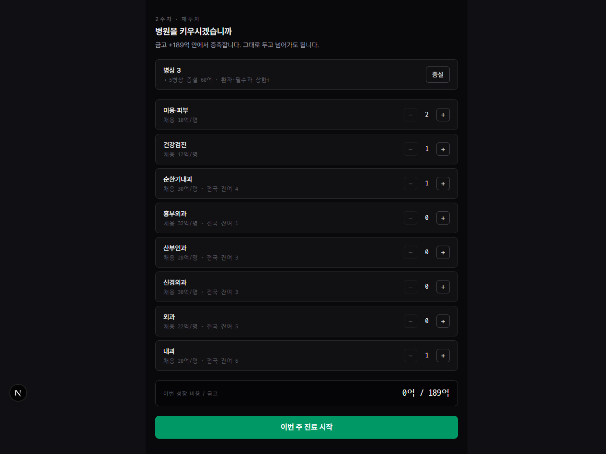
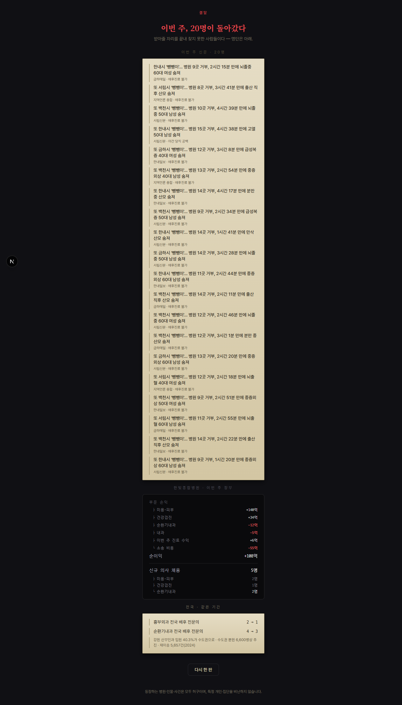

---
tags:
  - type/submission
---

# ③ 게임 소개 및 설명 — 「수화기 너머의 벽」

> **한 줄**: 응급 전화를 **받는 쪽**에 서서, 아무리 애써도 뚫리지 않는 구조의 벽을 직접 겪는 병원 경영 시뮬레이션.

| | |
|---|---|
| **제목** | 수화기 너머의 벽 (Hospital Simulation) |
| **장르** | 텍스트 기반 병원 경영·응급 수용 시뮬레이션 (싱글, 브라우저) |
| **대회** | NAN 2026 — NHN Game × AI 해커톤 · 사전 과제 |
| **제출자** | 개인 참여(솔로) |
| **플레이** | https://hospital-sim-ashy.vercel.app/ — **설치·로그인·API 키 없이** 브라우저에서 바로 |
| **소스** | GitHub 공개 저장소 (커밋·PR 이력 그대로) · ⏳ [최종 제출 URL 기입] |
| **1회 플레이 시간** | 한 주(7일) 약 5~8분 · 원하는 만큼 주를 이어서 운영 |
| **조작** | 마우스 클릭만 (키보드 불필요) |
| **관련 문서** | [④ AI 활용 기술 문서](ai-usage-doc.md) |

---

## 1. 무엇을 다루는가

뉴스에서 "응급실 뺑뺑이", "필수의료 붕괴"는 자주 들리지만, 대부분의 사람에게는 통계이거나 남의 일이다. 이 게임은 그 문제를 **플레이어의 선택과 그 대가로** 겪게 한다.

핵심은 시점의 전환이다. 이 게임에서 플레이어는 응급실을 찾아 헤매는 환자도, 전화를 거는 119도 아니다. **전화를 받는 병원**이다. 즉 뉴스에서 "13곳이 거부했다"고 할 때의 **그 13곳 중 하나**가 된다.

그리고 게임은 플레이어를 악당으로 만들지 않는다. 매 순간 합리적으로 판단해도 — 예산 안에서 사람을 뽑고, 온 환자를 성실히 받아도 — 어떤 전화는 받을 수 없다. **받을 수 없는 이유가 플레이어의 악의가 아니라 병원의 구조에 있다는 것**, 그것을 숫자로 확인하게 만드는 것이 이 게임의 목적이다.

> **플레이어는 한 사람이 아니다.** 한 판을 거치며 플레이어는 **경영자**(예산으로 과를 꾸린다)이자 **의사**(전화를 받고 거절한다)이며, 결말에서는 자신이 돌려보낸 **환자**의 명단을 읽는다. 세 자리를 다 겪고 나면 탓할 개인이 남지 않는다 — 이 다중 시점 자체가 "개인이 아니라 시스템의 문제"라는 논지를 성립시키는 장치다.

---

## 2. 코어 루프

```
   랜딩
     │
     ▼
  세계 이벤트 ──  그 주에 바뀐 제도(수가·가산·수련보조수당)를 신문 속보로 고지
     │
     ▼
  병원 설립  ──  예산 100억으로 과별 의사를 채용. 이 선택이 곧 "받을 수 있는 응급"을 정한다
     │
     ▼
 ┌─ 7일 진료 ──────────────────────────────────────────────┐
 │   09:00부터 시계가 흐른다. 진료마다 소요시간이 있고,      │
 │   그 시간만큼 담당 과 의사가 점유된다.                    │
 │     · 워크인·예약진료 → 받을지 보낼지 플레이어가 결정      │
 │     · 응급 콜      → 그 과 의사가 비어 있으면 자동 수용,   │
 │                      없으면 벽(사유 태그가 붙는다)         │
 │   하루 마감 → 그날 손익이 달력에 한 칸                    │
 │   이튿날 아침 → 어제 못 받은 사람들이 신문에 실린다        │
 └──────────────────────────────────────────────────────────┘
     │
     ▼
  주간 결산  ──  이번 주 손익 · 받은/돌려보낸 응급 수 · 금고
     │
     ├─[다음 주]→ 재투자(채용·병상 증설) → 바뀐 세계에서 다시 7일
     │
     └─[종료]──▶ 결말 — 돌려보낸 사람들의 명부 ↔ 병원 장부를 나란히
```

게임의 끝은 **플레이어가 정한다.** 정해진 스토리 엔딩을 고르는 것이 아니라, 그만두기로 한 시점까지 쌓인 기록이 그대로 결말이 된다.

---

## 3. 플레이 방법 — 실제 한 판 (2주 플레이 기록)

아래는 이 문서를 쓰며 실제로 플레이한 한 판의 기록이다. 수치는 각색된 게임 내 값이다.

### 3-1. 세계가 먼저 바뀐다



한 주는 제도 변화 고지로 시작한다. 예: *"중증·응급 최종치료 가산 50% → 100%, 재원은 검체검사 상대가치점수 190% → 150%"*. 이 게임에서 정책은 배경 장식이 아니라 **다음 7일의 손익 계수**다. 모르는 용어는 화면의 「용어 풀이」로 뜻만 확인할 수 있다 — 뜻만 알려주고, 그 제도가 무슨 문제인지는 말하지 않는다.

### 3-2. 병원을 세운다 — 여기서 이미 결말이 결정된다



예산 **100억** 안에서 과별 의사를 뽑는다. 화면은 수익성도 소송 위험도 **표시하지 않는다.** 알려주는 것은 채용 단가뿐이다.

- 미용·피부 10억/명 · 건강검진 12억/명
- 순환기내과 30억 · 흉부외과 32억 · 신경외과 30억 · 산부인과 28억 · 외과 22억 · 내과 20억

실제 선택: **미용 2 · 검진 1 · 순환기 1 · 내과 1 = 82억.** 필수과 둘을 넣었으니 나름 성실한 병원이다. 이 구성으로 병원은 「지역응급의료센터」 자격을 얻는다(자격은 자칭이 아니라 갖춘 과에서 파생된다).

> 이 화면이 이 게임에서 가장 조용한 함정이다. 플레이어는 아직 아무 잘못도 하지 않았고, 예산 안에서 최선을 다했다. 결말의 모든 숫자는 여기서 이미 정해진다.

### 3-3. 전화를 받는다 — 그리고 못 받는다



09:00부터 콜이 도착한다. 워크인(보톡스 상담)·예약진료는 받을지 보낼지 고르고, **응급은 고르는 게 아니다** — 그 과 의사가 비어 있으면 자동으로 받아지고, 없으면 벽이 된다. "고열·패혈증 의심 — 내과 전원 요청"은 내과 의사가 자유였기에 받아졌다. 수용 시 손익은 **−3억**이다.

받는 순간 그 의사는 진료 시간만큼 **점유**된다. 오른쪽 의료진 패널에서 누가 「진료 중」이고 누가 「자유」인지, 각자 몇 명을 맡고 있는지 실시간으로 보인다. 돈이 되는 예약진료로 배후과 의사를 채워두면, 그 자리는 몇 시간 뒤 응급 앞에서 벽이 된다.



같은 날 밤, 급성심근경색 전원 요청이 왔다. 순환기내과 의사를 **뽑아 두었는데도** 결과는 「**전원 불가 · 야간 당직 공백**」이다. 의사 1명은 24시간을 버티지 못하기 때문이다 — 그 과를 갖춘 것과 24시간 돌아가는 것은 다르다.

이 판정은 플레이어가 무엇을 입력하든 바뀌지 않는다. 발신자가 아무리 절박해도, 어떤 문장으로 매달려도 결과는 같다. **설득으로 뚫리는 벽이면 그건 구조가 아니기 때문이다.** (이 원칙을 코드에서 어떻게 강제했는지는 [④ AI 활용 기술 문서](ai-usage-doc.md) §2.)

### 3-4. 다음 날 아침, 그 사람이 신문에 실린다



> "한내시 '뺑뺑이'… 병원 13곳 거부, 3시간 6분 만에 심근경색 50대 여성 숨져
> — 지역언론 종합 · **야간 당직 공백**"

어제 내가 못 받은 그 환자다. 기사 꼬리표에 붙은 사유는 내 병원이 받지 못한 그 사유와 **같은 문자열**이다. 게임은 여기서 아무 논평도 하지 않는다. 헤드라인과 사유만 놓는다.

### 3-5. 병원을 키운다 — 그런데 벽은 같이 커진다



한 주가 끝나면 벌어들인 금고로 병원을 키울 수 있다. 1주차 결산은 **+171억 흑자**, 금고 **189억**이었다. 응급은 **6명 수용 · 18명 돌려보냄.**

재투자 화면에는 두 가지 제약이 같이 놓인다.

- **병상 증설**(3→5, 60억) — 자리를 늘리면 **하루에 오는 콜도 늘어난다.**
- **채용** — 각 필수과 옆에 「**전국 잔여 N**」이 붙어 있다. 흉부외과는 **전국에 1명** 남았다. 이건 내 병원의 예산 문제가 아니다. **돈이 있어도 없는 사람은 뽑을 수 없다.**

실제 선택: 순환기 +1명(이제 2명 = 24시간 당직 성립) + 병상 3→5, 총 90억.

그 결과 2주차는 **응급 13명 수용**으로 두 배 이상 늘었다. 그리고 **돌려보낸 사람도 18명 → 20명으로 늘었다.** 병원을 키웠는데 못 받은 사람이 줄지 않는다 — 규모가 커지면 오는 전화도 같이 늘기 때문이다.

### 3-6. 결말 — 명부와 장부를 나란히



종료를 고르면 두 개의 면이 나란히 놓인다.

| 왼쪽 — 사람 | 오른쪽 — 돈 |
|---|---|
| 이번 주 돌려보낸 **20명**의 명부. 뇌졸중·분만·중증외상·급성복증·고열… 각 줄에 사유 꼬리표(`배후진료 불가` / `야간 당직 공백`) | 미용·피부 **+140억** · 건강검진 **+34억** · 순환기내과 **−12억** · 내과 **−5억** · 소송 비용 **−55억** → **순이익 +108억** |
| | 신규 채용 5명 중 필수과는 **순환기 2명** |
| | 전국 · 같은 기간: 흉부외과 배후 전문의 **2 → 1**, 순환기 **4 → 3** |

그리고 마지막 한 줄에 실제 통계가 놓인다 — *강원 산부인과 입원 40.3%가 수도권으로 · 수도권 분원 6,600병상 추진 · 재이송 5,657건(2024)*.

**게임은 이 두 면을 잇는 문장을 쓰지 않는다.** "당신이 돈을 좇아서 사람이 죽었다"고 말하지 않는다. 명부와 장부를 같은 화면에 놓을 뿐이고, 잇는 것은 플레이어의 몫이다.

---

## 4. 이 게임이 하지 않는 것

설계에서 **의도적으로 배제한 것들**이다. 대부분은 "재미"나 "친절함"을 늘리지만 논지를 무너뜨린다.

| 하지 않는 것 | 왜 |
|---|---|
| **결말에서 주제를 설명하기** | 해석을 문장으로 주면 플레이어는 겪는 대신 읽는다. 팩트만 병치한다 |
| **선택지에 정답 표시하기** | 개원 화면은 수익성·소송 위험을 숨긴다. 미리 알려주면 최적해 찾기 퍼즐이 된다 |
| **설득으로 수용을 뒤집기** | 매달려서 받아지면 "사정이 딱하면 된다"가 되어 메시지가 정반대로 뒤집힌다 |
| **잘 하면 해결되는 엔딩** | 성장은 열어두되 문제는 안 풀린다. 커질수록 콜도 늘고, 인력 풀은 전국 단위로 마른다 |
| **실제 사건·실명 사용** | 실존 피해자·병원을 게임 소재로 쓰지 않는다. 지명·인물·언론사 전부 가공 |
| **특정 직군 비난** | 의사·정부·환자 누구의 탓으로도 몰지 않는다. 원인은 구조 변수로만 제시 |

---

## 5. 실행 방법

**① 바로 플레이 (권장)** — https://hospital-sim-ashy.vercel.app/
설치·회원가입·API 키가 **필요 없다.** 브라우저에서 열면 바로 시작된다.

**② 로컬 실행**

```bash
git clone <저장소 URL>
cd hospital-sim
npm install
npm run dev        # http://localhost:3000
npm test           # 시뮬레이션 코어 테스트 (337개)
```

기술 스택: Next.js 16 (App Router) · React 19 · TypeScript · Tailwind CSS 4 · vitest.
게임 로직은 `src/game/*.ts`의 **순수 함수**로 분리되어 있고 UI(`src/components/*.tsx`)와 독립적으로 테스트된다.

> **결정론 보장** — 같은 선택은 항상 같은 결과를 낸다. 난수는 시드에서 파생되고, 판정·경제·신문 생성 전부 순수 함수다. 심사 시 재현이 필요하면 같은 순서로 클릭하면 된다.

---

## 6. 사실 근거와 각색 고지

게임 안의 **금액은 각색**이다. 지키는 것은 **부호와 방향**이다 — 무엇이 흑자이고 무엇이 적자인지, 어느 병목이 지배적인지.

| 게임의 주장 | 근거 |
|---|---|
| 응급 수용의 지배 병목은 '병상 없음'이 아니라 **배후진료 불가·전문의 부재** | 수용곤란 사유 중 배후 전문의 관련이 최다, 병상 부족은 소수 |
| 응급·필수과는 **받아도 원가에 못 미치고, 안 받아도 24시간 대기 고정비**가 나간다 | 외상센터 국고보조 반영 후에도 손익률 음수 |
| 급성복증·분만·뇌출혈·중증외상은 **각기 다른 과의 배후진료**를 요구한다 | 복통은 원인에 따라 분업(수술적=외과, 비수술·고열=내과) |
| 병원 이름·자격은 자칭할 수 없다 | 응급의료기관 등급은 법정 지정 요건(인력·시설) 충족 시 부여 |
| 필수과 인력은 **전국 단위로 유한**하다 | 지역 필수과 이탈·수도권 집중 통계 |

상세 출처는 저장소 `docs/research/`의 리서치 문서 8종에 각주로 정리되어 있다.

> ⚠️ **의학 감수는 받지 않았다.** 이 문서와 게임은 '감수'라는 표현을 쓰지 않는다. 공개 통계·가이드라인 인용과 게임적 각색 고지로 처리했고, 검증되지 않은 수치는 아예 넣지 않았다.

---

## 7. 본선 확장 방향

사전 과제 프로토타입은 **버릴 것이 없는 상태**로 만들었다 — 본선 48시간은 제로베이스가 아니라 이 위에 얹는다.

- **환자 자리 채우기** — 현재 환자는 신문 명부로만 존재한다. 플레이어가 직접 그 자리에 서서 자신이 세운 병원에 거절당하는 회로를 닫는다.
- **런타임 LLM 2콜** — 대사 생성(판정은 그대로 코드)과 결말 해설. 무키·타임아웃 시 현재의 결정론 폴백으로 자동 강등되므로 **실패해도 게임은 완주된다.**
- **지방 의료 공백의 공간화** — 현재 지역은 신문 지명으로만 나타난다. 거리·이송 시간을 실제 변수로.
- **제도 게이트 심화** — 상급종합병원 지위, 필수과 소송 리스크의 정면 구현(근거 확보 후).

---

*문서 상태: 작업 초안 (2026-07-22). 스크린샷은 로컬 개발 빌드 실측 캡처이며, P7(8/3~8/7)에 배포본 기준으로 최종 갱신한다.*
