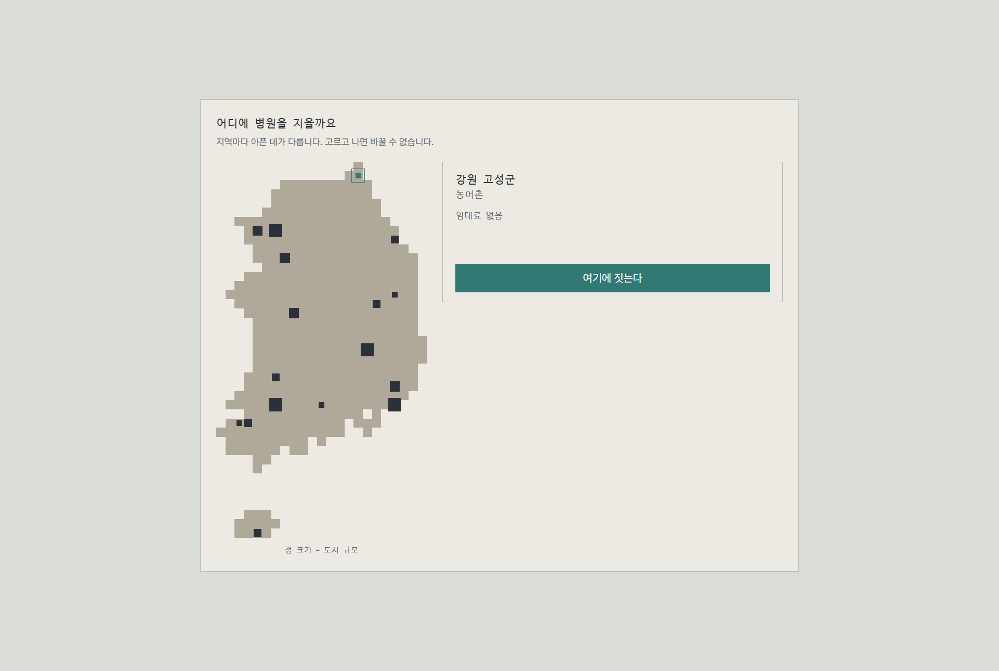
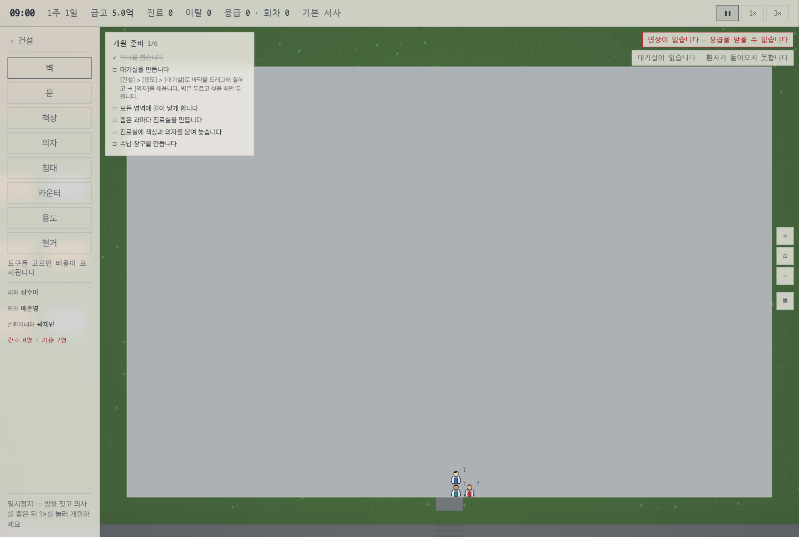
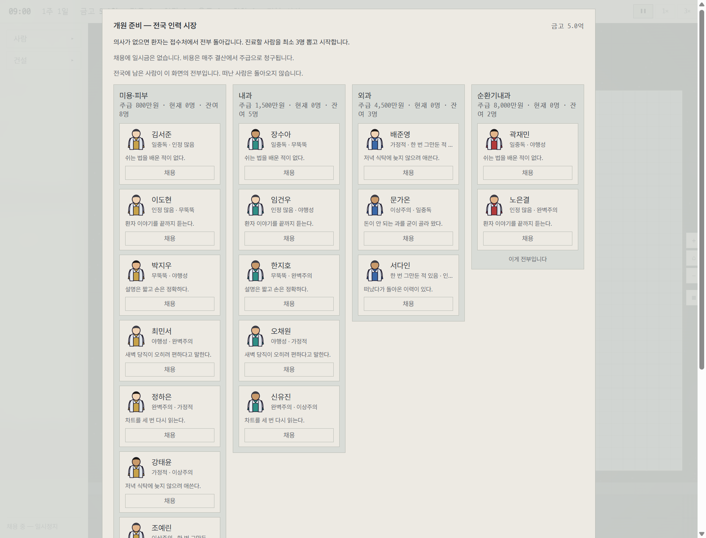
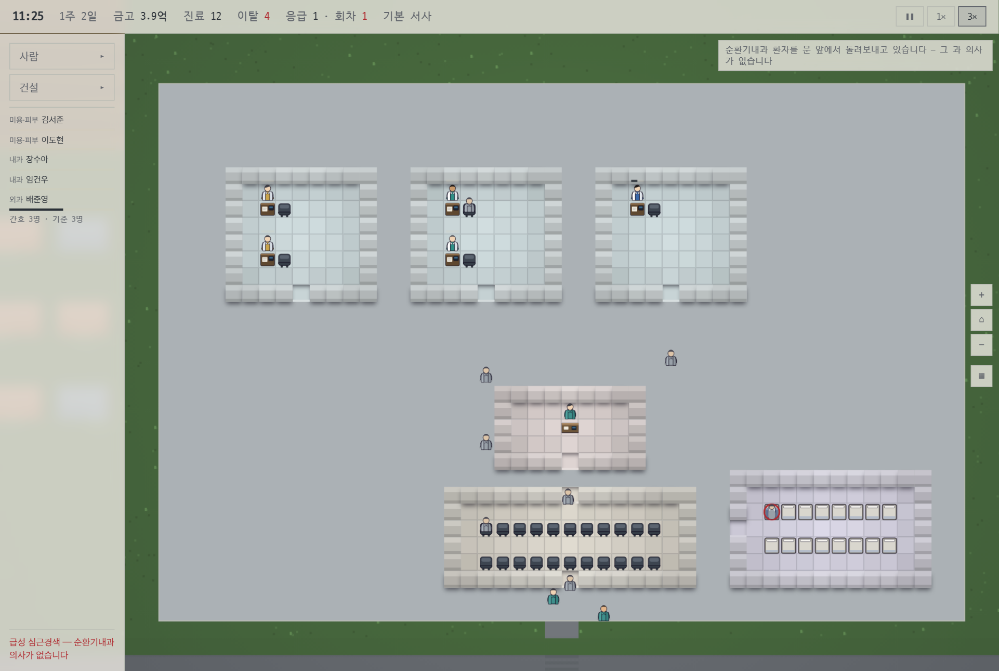
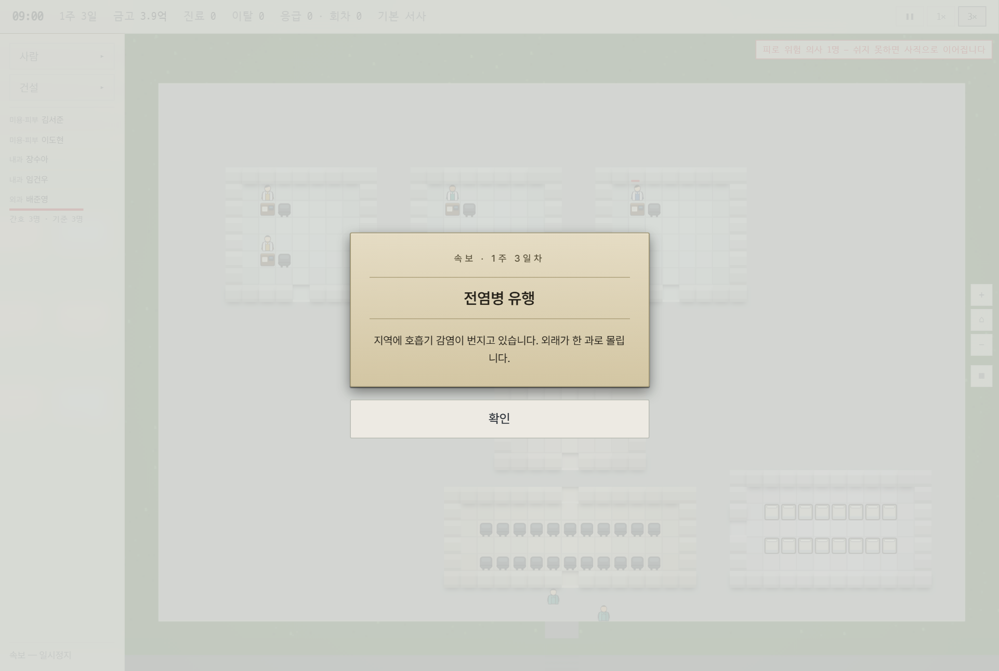
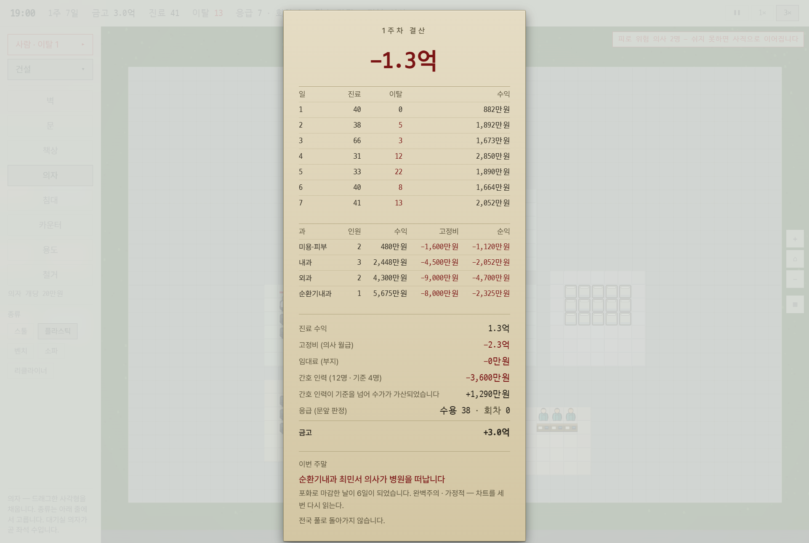
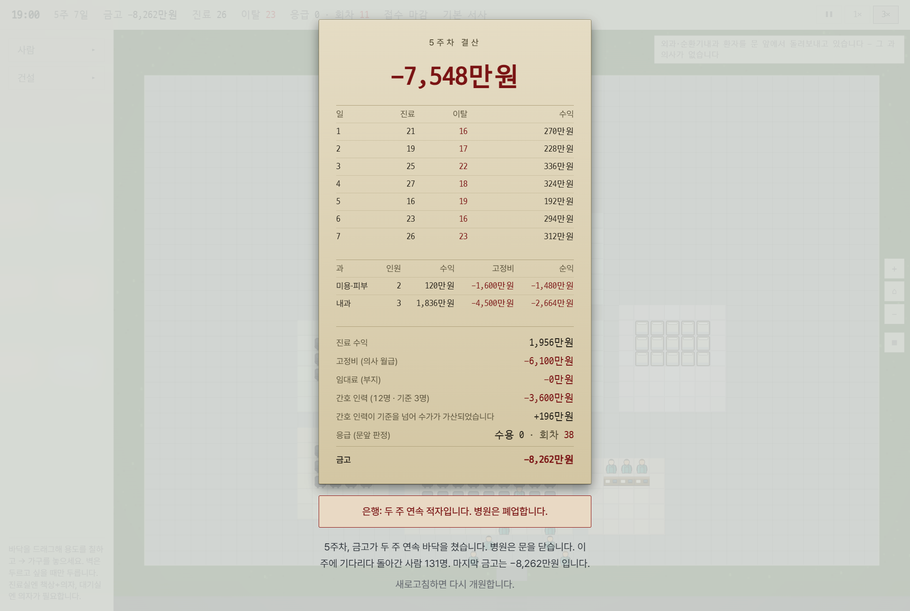

---
tags:
  - type/submission
---

# ③ 게임 소개 및 설명 — 「심스피탈(SimSpital)」

> **한 줄**: 빈 부지에 병원을 짓고 사람을 뽑아 최선을 다해 굴려도, 끝내 못 받는 환자와 떠나는 의사가 남는 것을 **직접 겪는** 경영 시뮬레이션.

| | |
|---|---|
| **제목** | 심스피탈 (SimSpital) — 시뮬레이션(Sim) + 병원(hoSPITAL) 합성 |
| **장르** | 타일 기반 병원 건설·운영 시뮬레이션 (싱글, 브라우저) |
| **대회** | NAN 2026 — NHN Game × AI 해커톤 · 사전 과제 |
| **제출자** | 개인 참여(솔로) |
| **플레이** | https://goospel.github.io/hospital-sim/ — **설치·로그인·API 키 없이** 브라우저에서 바로 |
| **소스** | https://github.com/Goospel/hospital-sim (커밋·PR 이력 그대로) |
| **한 판** | 최장 **12주**(주 7일) · 게임 시계 조작(❚❚ / 1× / 3×)으로 조절 |
| **조작** | 마우스 클릭·드래그만 (키보드 불필요) |
| **AI** | 스토리텔러 3종 — 그날의 사건 선택+속보 · 사직 편지 · 결말문. **없어도 완주된다**(결정론 폴백으로 자동 강등) |
| **관련 문서** | [④ AI 활용 기술 문서](ai-usage-doc.md) |

> 📸 이 문서의 스크린샷은 전부 **현재 본편 빌드**에서 캡처한 것이다.

---

## 1. 무엇을 다루는가

뉴스에서 "응급실 뺑뺑이", "필수의료 붕괴"는 자주 들리지만, 대부분의 사람에게는 통계이거나 남의 일이다. 이 게임은 그 문제를 **플레이어의 선택과 그 대가로** 겪게 한다.

플레이어는 응급실을 찾아 헤매는 환자도, 전화를 거는 119도 아니다. **병원을 짓고 운영하는 쪽**이다. 즉 뉴스에서 "13곳이 거부했다"고 할 때의 **그 13곳 중 하나를 자기 손으로 세운다.**

그리고 게임은 플레이어를 악당으로 만들지 않는다. 매 순간 합리적으로 판단해도 — 예산 안에서 방을 짓고, 사람을 뽑고, 온 환자를 성실히 받아도 — 어떤 환자는 받을 수 없고 어떤 의사는 떠난다. **그 이유가 플레이어의 악의가 아니라 병원과 인력 시장의 구조에 있다는 것**, 그것을 숫자로 확인하게 만드는 것이 이 게임의 목적이다.

### 메시지는 문장이 아니라 규칙에서 창발한다

이 게임은 결말에서 주제를 설명하지 않는다. 대신 **네 개의 규칙**이 맞물려 "개인이 최선을 다해도 구조 때문에 나쁜 결과가 나온다"를 만든다. 넷 다 코드의 상수이고, 문서가 아니라 장부가 그것을 증명한다.

**① 필수과는 잘 굴릴수록 적자다** — 과 카탈로그(`src/sim/dept.ts`)의 수가와 주 고정비가 이렇게 잡혀 있다.

| 과 | 외래 한 건 수가 | 의사 1명 주 고정비 | 전국에 남은 인원 |
|---|---|---|---|
| 미용·피부 | 30만원 | 800만원 | **8** |
| 내과 | 12만원 | 1,500만원 | 5 |
| 외과 | 25만원 | 4,500만원 | 3 |
| 순환기내과 | 25만원 | 8,000만원 | **2** |

> 이 표의 인원은 **전국 기준값**이다. 판을 시작할 때 고른 지역이 여기서 사람을 깎는다 — 대도시 도심은 표 그대로지만, 신도시는 외과·순환기가 한 명씩, 지방 소도시와 농어촌은 네 과가 모두 얇아진다(농어촌 미용은 8명이 아니라 **2명**이다). **「어디에 병원을 세웠는가」가 「몇 명까지 갈아 넣을 수 있는가」를 먼저 정한다.**

미용은 비급여라 수가가 가장 높고 24시간 대기가 없어 고정비가 가장 가볍다. 필수과는 정반대다. 내과는 가장 많이 보는데(주 85~89건 실측) 가장 얇게 진다 — 저수가의 형태다. **'흑자'라는 필드는 어디에도 없다.** 흑자·적자는 이 표와 플레이어의 건설·채용이 만나 **장부에서 창발한다.**

**② 응급은 받아도 못 메운다** — 급성 심근경색 한 건은 350만원, 급성복증은 150만원이다. 외래의 6~14배지만, 순환기 의사의 주 고정비 8,000만원을 채우려면 주 23건이 필요한데, **응급이 가장 많이 오는 농어촌에서조차 주 20건 언저리가 상한이다**(도심 기준으로는 17건). 즉 **어느 지역에서 응급을 최대로 받아도 그 과는 적자다.** 이 간격은 부호 불변식으로 테스트에 잠겨 있고, 응급 수요가 가장 큰 농어촌까지 같은 부호로 잠근다.

**③ 응급 앞의 벽은 설득으로 안 뚫린다** — 응급이 도착하면 (ⓐ 그 배후과 의사 중 **응급을 켠** 사람이 있는가 ⓑ 빈 병상이 있는가)를 결정론 코드가 본다. 없으면 「(그 배후과) 의사가 없습니다」 / 「병상이 없습니다」라는 사유만 남기고 문 앞에서 되돌아간다(하루 마감 요약에는 `의사 없음 N` · `병상 없음 N`으로 집계된다). 플레이어가 입력할 수 있는 텍스트는 애초에 없다 — **설득으로 뚫리는 벽이면 그건 구조가 아니기 때문이다.**

**④ 사람은 갈리고, 갈린 사람은 돌아오지 않는다** — 의사는 하루 부하가 **표준강도 160분**을 넘긴 만큼 피로가 쌓이고(초과 1시간당 +15), 밤에 20만 회복된다. 그래서 무거운 날이 이어지면 피로가 상한 100까지 차오르고, **피로 100으로 마감한 날이 4일 쌓이면 그 의사는 주말에 사직한다.** 그 자리를 다시 채우려면 위 표의 「전국에 남은 인원」에서 꺼내야 하는데, 그 풀은 한 판 동안 **줄기만 한다** — 채용이 깎고, 떠난 사람은 다시 채워지지 않는다. 총량은 병원을 세운 지역이 정한다: 대도시 도심은 18명이지만 **농어촌은 8명뿐**이다. 응급을 받는 과일수록 강도가 높고(응급 처치 강도 1.7 — 외래 기준선의 1.7배) 풀이 얇다. 순환기는 전국에 2명인데, **그것도 도심 이야기다.** 도심 밖(신도시·지방·농어촌)에서는 시작부터 **한 명**뿐이라, 그 한 명을 태우는 순간 그 병원엔 심근경색을 받을 사람이 영원히 없다.

그래서 판의 끝 세 가지 중 하나는 **사람이 바닥남**(`NO_PEOPLE`)이다. 돈이 아니라 **사람이 없어서** 병원이 닫힌다 — 이 게임 메시지의 엔딩판이다.

---

## 2. 코어 루프

```
   지역 선택(대한민국 17곳) · 빈 부지 · 금고 5억 · 개원 전 의사 최소 3명
     │
     ▼
  ┌─ 건설 ── 도구 여덟(벽·문·책상·의자·침대·카운터·용도·철거)
  │            **용도를 칠한 자리가 곧 방이다** — 진료실·대기실·병동·접수처·휴게실·식당
  │            (진료실은 과를 골라야 칠해진다 · 최소 크기 없음 · 벽은 선택)
  │            벽 30 · 문 50 · 책상·카운터 100 · 의자 20 · 침대 300만원(개당)
  │            용도 지정은 무료 · 철거는 50% 환불 · 드래그하는 동안 시간이 멈춘다
  │  채용 ── 「전국 인력 시장」— 과 탭을 고르면 그 과에 남은 사람이 카드로 펴진다
  │            (이름·특성 둘·사연) 뽑으면 그 카드가 사라지고, 목록은 줄기만 한다
  │            간호사도 뽑는다 — 접수처 카운터에서 진료비를 걷고,
  │            인원이 ⌈의사 수 ÷ 2⌉에 닿는지가 간호등급을 가른다(주간 진료 수익 ±10%)
  │  인사 ── 의사마다 진료·응급·휴식 세 축의 우선순위를 0~3으로 토글
  │     │
  │     ▼
  │ ┌─ 하루(09:00~19:00 · 600분) ────────────────────────────┐
  │ │   환자가 정문으로 걸어 들어와 대기실에 앉는다.          │
  │ │   자기 과 진료실의 의사가 차례로 부른다.                │
  │ │     · 응급 → 응급을 켠 배후과 의사와 빈 병상이 있으면   │
  │ │              수용, 없으면 문 앞에서 회차(사유가 남는다) │
  │ │     · 의사는 지치고(피로), 배고파지고(허기),            │
  │ │       휴게실·식당이 있으면 스스로 간다                  │
  │ │   19:00 마감 → 그날 수익·진료·이탈·응급이 한 장으로     │
  │ └────────────────────────────────────────────────────────┘
  │     │  이튿날 아침 — 사건이 붙으면 「속보」 카드가 뜬다(5종)
  │     ▼
  └── 7일째 밤 · 주간 결산 ── 이번 주 손익 · 과별 장부 · 임대료(지역별) · 간호등급 가감산
        │                     · 응급 수용/회차 · 떠나는 의사의 **사직 편지**와 간호사 이탈
        │
        ├─[다음 주]→ 다시 건설·채용 → 바뀐 병원으로 또 7일
        │
        └─[판 종결]──▶ 에필로그 — 셋 중 하나
                        · 돈이 바닥남 (금고가 음수로 끝난 주 2주 연속)
                        · **사람이 바닥남** (의사 0 + 전국 풀 0)
                        · 기간 종료 (12주)
```

판의 끝은 **플레이어가 고르는 것이 아니다.** 위 세 조건 중 하나가 주간 결산에서 성립하면 그 주가 마지막이다.

---

## 3. 플레이 방법

### 3-1. 어디에 지을지부터 고른다



첫 화면은 **대한민국 지도**다. 17곳 중 한 곳을 고르면 그 자리가 네 유형(대도시 도심 · 신도시 · 지방 소도시 · 농어촌) 중 하나로 매핑되고, **고르고 나면 바꿀 수 없다.**

지역이 정하는 것은 배경 그림만이 아니다.

| 지역이 바꾸는 것 | 어떻게 |
|---|---|
| **시작 채용 풀** | 도심 18명 · 신도시 16명 · 지방 10명 · 농어촌 **8명** (얇은 과일수록 더 깎인다) |
| **부지 임대료** | 주 1,200 / 800 / 300 / **0만원** — 주간 결산에서 순익에 직접 빠진다 |
| **응급 도착률** | 농어촌 ×1.2 · 도심·지방 ×1.0 · 신도시 ×0.8 |
| **의료소송 비용** | 도심 400만원 ~ 농어촌 1,600만원 |

**싼 곳일수록 사람이 없다.** 임대료가 0인 농어촌은 순환기 의사가 시작부터 한 명뿐이고, 응급은 가장 많이 온다. 이 화면이 말해 주는 것은 **이름·분류·임대료뿐**이고, 나머지는 고른 뒤 판에서 드러난다.

### 3-2. 빈 부지에서 시작한다



방 하나 없는 48×32 부지와 금고 **5억**(50,000만원)에서 시작한다. 추천 구성도, 자동 배치도 없다.

좌측 팔레트는 **한 번에 한 계층만** 편다. 맨 위에 서 있는 것은 [사람]과 [건설] 둘뿐이고, [건설]을 누르면 그 자리가 **도구 여덟**로 갈린다 — 벽 · 문 · 책상 · 의자 · 침대 · 카운터 · 용도 · 철거. [용도]를 고르면 다시 그 자리가 방 종류 목록이 되고, 머리줄의 「‹」가 지금 어디인지와 한 단계 위로 나가는 길을 겸한다. **방은 명령이 아니라 결과다**: [용도]로 바닥을 칠하면 칠한 자리가 그대로 방이 되고, 벽으로 두를 필요도 최소 크기도 없다(한 칸만 칠해도 방이다). 벽과 문은 나누고 싶을 때만 세운다.

**용도 지정 자체는 무료이고**, 돈은 놓는 것에서 나간다 — 개당 벽 30만원 · 문 50만원 · 책상 100만원 · 의자 20만원 · 침대 300만원 · 카운터 100만원(철거하면 절반이 돌아온다).

칠할 수 있는 용도는 여섯이다(잘못 칠한 자리는 「지정 해제」로 지운다).

| 용도 | 무엇을 하나 |
|---|---|
| **진료실** | 진료가 일어나는 곳. **과를 골라야 지정된다** — 환자·진료실·의사의 과가 셋 다 맞아야 진료가 성립한다. 칠하기만 한 방은 **빈 방**이다: 책상 하나에 의자 하나를 붙여야 그 자리가 진료 자리 하나가 된다(책상만 놓으면 의사는 앉지 못한다) |
| **대기실** | 환자가 앉아 기다린다. 의자 수 = 좌석 수(앉을 자리가 없으면 환자는 떠난다) |
| **병동** | 침대. **응급을 받으려면 반드시 있어야 한다** |
| **접수처** | 카운터 + **간호사**가 있어야 진료비가 걷힌다. 없으면 진료는 해도 돈이 **미수**로 새고, 결산이 그 액수를 따로 보여준다 |
| **휴게실** | 지친 의사가 스스로 가서 쉰다 |
| **식당** | 굶은 의사가 밥을 먹는다(20분). 없으면 근무 300분이 지난 의사는 굶은 채로 남아 모든 작업이 **1.3배** 느려진다 |

> 이 화면이 이 게임에서 가장 조용한 함정이다. 화면은 **어느 과가 돈이 되는지 알려주지 않는다.** 알려주는 것은 건설 단가와 **주급**뿐이다 — 채용에 일시금은 없고(그 사실도 화면이 말한다) 대가는 매주 결산에서 온다. 어느 과가 얼마를 버는지 — 수가 — 는 어디에도 없다. 결말의 모든 숫자는 여기서 이미 정해진다.

### 3-3. 사람을 뽑는다 — 그리고 그 명단은 줄기만 한다



개원 전에 **의사 3명**을 채워야 판이 굴러간다. [사람] > [채용]을 누르면 **전국 인력 시장**이 열린다 — **과 탭 넷** 중 하나를 고르면 그 과에 지금 전국에 남은 사람이 **한 장씩 카드로 전부 펴진다.** 한 번에 펴지는 것은 한 과지만 **대조는 네 과가 함께 선다**: 탭 한 칸이 과 이름과 「주급 · 현재 · 잔여」를 같이 이고 있어, 접어 둔 과의 주급과 남은 인원도 같은 줄에서 읽힌다(잔여가 0인 과는 탭에서 붉게 뜬다). 그 **잔여** 인원은 **고른 지역이 정한다.** 대도시 도심이면 미용 8 · 내과 5 · 외과 3 · **순환기 2**(총 18명)이지만, 신도시는 외과·순환기가 한 명씩 줄어 16명, 지방 소도시는 미용이 4로 깎여 10명, 농어촌은 미용이 2까지 내려가 **8명**이다. 어느 지역이든 한 판 전체에서 뽑을 수 있는 총량이 그것뿐이고, 사직한 사람은 **돌아오지 않는다.** 남은 카드가 두 장 이하로 줄면 그 과의 선반 끝에 「이게 전부입니다」가 서고, 다 빠진 과를 열면 「전국에 남은 (그 과) 의사가 없습니다」만 남는다.

카드 한 장이 한 사람이다 — **초상 · 이름 · 특성 두 개 · 사연 한 줄**. 「일중독 · 이상주의」, 「가정적 · 한 번 그만둔 적 있음」처럼 붙고, **뽑기 전부터 보인다**: 누구를 태울지 고르는 것이지 뽑고 나서 통보받는 것이 아니다. 카드에서 본 얼굴이 부지에 그대로 선다. 특성에는 **수치 효과가 없다.** 그건 사직 편지와 연출문의 재료다: 떠나는 것이 「내과 1명」이 아니라 **사람 하나**임이 드러나야 하기 때문이다.

의사만 뽑는 것이 아니다. **간호사**(주급 300만원 · 과 없음)를 뽑아야 접수처 카운터에서 진료비가 걷히고, 간호 인력 수는 주간 결산에서 **등급으로 환산돼 수가를 ±10% 가감산**한다 — 기준은 의사 2명당 간호사 1명이다. 여기서도 화면은 어느 쪽이 이득인지 알려주지 않는다: 미달 감산이 간호사 주급보다 쌀 수도, 비쌀 수도 있고 그건 **병원이 얼마나 버는가**가 정한다.

### 3-4. 우선순위를 정한다 — 여기가 이 게임의 진짜 손잡이다

[사람] > [인사] 패널에서 의사마다 세 축을 0~3(금지 / 낮음 / 보통 / 높음)으로 토글한다.

- **진료** — 외래를 볼 것인가
- **응급** — 응급 콜을 받을 것인가
- **휴식** — 지쳤을 때 쉬러 갈 것인가

세 축이 다 기본값 「보통」에서 시작한다. 여기서 갈리는 결정이 이 게임의 핵심이다. 순환기 의사의 응급을 **「금지」로 내리면** 그 병원은 심근경색을 못 받는다 — 그리고 그 판정은 **뽑지 않은 것과 완전히 같다.** 반대로 켜 두면 그 사람이 갈려나간다. 휴식을 올리면 덜 갈리는 대신 진료를 덜 본다.

그리고 그 대가는 패널을 열지 않아도 보인다 — 팔레트 아래쪽에 지금 있는 의사가 **과 · 이름 · 피로 막대**로 한 줄씩 상주하고, 이번 주말에 떠날 사람은 이름이 붉어지며 「떠남」이 함께 선다. 그 아래에 간호 인력 한 줄(「간호 N명 · 기준 M명」)이 붙는다. 줄을 누르면 그대로 [인사]가 열린다.

**돈·사람·환자 셋 중 무엇을 포기할지를 정하는 자리이고, 셋 다 지킬 수 있는 설정은 없다.**

### 3-5. 하루가 흐르고, 응급이 문 앞에서 되돌아간다



09:00부터 시계가 흐른다(❚❚ / 1× / 3×). 환자가 정문으로 걸어 들어와 대기실 의자에 앉고, 자기 과 진료실의 의사가 차례로 부른다.

응급은 다르다 — **고르는 것이 아니다.** 급성 심근경색(순환기)·급성복증(외과)이 예고 없이 도착하면 코드가 두 가지만 본다: 그 과에서 응급을 켠 의사가 있는가, 빈 병상이 있는가. 있으면 수용되고 그 의사가 **90분 통째로 묶인다**(기본값이다 — 지치고 굶은 의사는 더 오래 걸려 최대 176분까지 늘어난다). 없으면 문 앞에서 되돌아가고 상단 바의 **「회차」** 숫자가 올라간다.

받는 쪽도 대가가 있다. 응급 한 건은 **표준강도 153분**(90분 × 강도 1.7)이라 무료 구간 160분 바로 아래다 — **1건은 공짜지만 2건이면 306분으로 넘어간다.** 무엇을 몇 건까지 받을지가 손잡이가 되도록 튜닝된 값이다.

> ⚠️ 다만 "1건은 공짜"는 **외래가 없는 격리 조건에서만** 성립한다. 실제로 굴러가는 병원은 외래 부하가 이미 130~155분이라(실측) 응급 1건인 날에도 합산으로 넘어간다. 이건 설계 실패가 아니라 **실측이 기대를 정정한 자리**이고, 문서와 코드 주석 양쪽에 그대로 남겼다.

### 3-6. 아침마다 사건이 붙는다 — AI 스토리텔러



둘째 날 아침부터, 하루가 시작될 때 사건이 붙을 수 있다(폴백 기준 하루 확률 0.25 — 한 주에 기대 1.75일). 붙으면 「속보」 카드가 뜨고 시간이 멈춘다.

| 사건 | 그날 하루 무슨 일이 |
|---|---|
| **대량 응급** | 응급 도착 확률 **×3** (2주차부터 · 병동이 있어야 열린다) |
| **전염병 유행** | 외래 ×1.6 + 환자의 희망 과가 **내과 중심으로 갈린다**(내과 없는 병원은 이 날 아무것도 못 한다) |
| **인근 병원 폐업** | 외래 ×1.4 (전 과) |
| **경증 쏠림** | 외래가 몰리는데 대부분 가벼운 환자다 (병상 2개 이상일 때 열린다) |
| **의료소송** | 금고에서 즉시 빠진다 — 액수는 **지역이 정한다**(도심 400만원 ~ 농어촌 1,600만원). 게다가 그 과 의사 한 명의 **응급 우선순위가 한 단계 내려간다** — 두 번 맞으면 0(금지)에 닿아 그 과 응급이 통째로 되돌아간다. 돌려보낸 응급이 소송으로 돌아오고, 소송이 다시 응급을 돌려보내게 만든다(회차 1건 이상일 때만 열린다) |

**무엇을 던질지 고르고 속보 문장을 쓰는 것이 이 게임의 AI다.** 다만 AI가 만질 수 있는 것은 **후보 목록 안의 선택 하나와 문장 한 토막뿐**이다 — 효과(×3·−800만원)도, 전제(병동이 있는가·회차가 있는가)도 전부 코드가 확정한다. API 키가 없거나 응답이 늦거나 규칙 밖의 답이 오면 **시드 결정론 폴백**이 대신 고르고 사전 작성 문장이 선다. 상단 바의 **「AI 서사」/「기본 서사」** 배지가 지금 어느 쪽인지 두 글자로 알려준다.

즉 **이 게임은 AI가 죽어도 완주된다.** 설계 근거와 그 경계를 어떻게 코드로 봉인했는지는 [④ AI 활용 기술 문서](ai-usage-doc.md) §2에 있다.

### 3-7. 7일째 밤 — 결산, 그리고 편지



7일째 밤에 주간 결산이 열린다. 이번 주 수입·주 고정비·**부지 임대료**·순익, 과별 장부, 받은 응급과 **회차**가 나란히 놓인다. 미용으로 번 돈과 순환기가 태운 돈이 같은 표에 있다.

임대료는 고른 지역이 정한 값이 매주 그대로 빠진다(도심 1,200 · 신도시 800 · 지방 300 · 농어촌 0만원). **싼 땅을 고르면 매주 돌려받는 대신 사람이 없다** — 3-1의 교환이 여기서 숫자로 돌아온다.

과별 표 아래에 **간호 인력 줄**이 선다 — 「간호 인력 (N명 · 기준 M명)」과 등급 가감산. 기준은 **의사 수의 절반**(⌈의사 수 ÷ 2⌉)이라 의사를 늘리면 기준도 함께 올라간다. 못 미치면 주간 진료 수익이 10% 깎인다. 이 규칙에는 판단하는 사람이 없다 — **못 구한 병원도 똑같이 깎인다.** 그리고 지금 눈금에서는 못 버는 병원일수록 감산을 감수하는 쪽이 "계산상 합리적"이 된다: 간호사 주급 300만원은 고정인데 감산액은 수익의 10%라, 주간 수익이 3,000만원에 못 미치면 안 뽑는 편이 싸다. **벌은 못 버는 병원이 받는다.**

간호사가 떠나면 그 줄에 **이탈**이 함께 뜬다 — 기준 미달로 배치된 날이 쌓이면 간호사도 그만둔다.

그리고 이번 주말에 떠나는 **의사**가 있으면 **사직 편지**가 함께 열린다. 이름·과·특성·포화로 마감한 날 수가 들어간 편지다. 원망도 훈계도 없다. (간호사에겐 편지가 없다 — 이탈 한 줄로만 뜬다.)

[다음 주]를 고르면 떠날 사람이 실제로 떠나고(전국 풀은 채워지지 않는다) 다시 7일이 시작된다.

### 3-8. 판의 끝 — 셋 중 하나



주간 결산에서 아래 조건이 성립하면 그 주가 마지막이고, 에필로그가 열린다. 우선순위는 **돈 → 사람 → 시간** 순이다.

| 엔딩 | 조건 | 무엇을 말하나 |
|---|---|---|
| **돈이 바닥남** | 금고가 음수인 채 2주 연속 | 흔한 폐업 |
| **사람이 바닥남** | 의사 0명(이번 주말 사직 선반영) **그리고** 전국 풀 0 | 돈이 아니라 **사람이 없어서** 닫는다 |
| **기간 종료** | 12주 도달 | 흑자여도 판은 끝난다 — 안 풀린 채로 |

에필로그는 남은 것과 사라진 것을 사실로 적는다. **잇는 문장은 쓰지 않는다.** 장부와 사직 명단을 같은 화면에 놓을 뿐이고, 잇는 것은 플레이어의 몫이다.

---

## 4. 이 게임이 하지 않는 것

설계에서 **의도적으로 배제한 것들**이다. 대부분은 "재미"나 "친절함"을 늘리지만 논지를 무너뜨린다.

| 하지 않는 것 | 왜 |
|---|---|
| **결말에서 주제를 설명하기** | 해석을 문장으로 주면 플레이어는 겪는 대신 읽는다. 팩트만 병치한다 |
| **선택지에 정답 표시하기** | 건설·채용 화면은 수익성을 숨긴다. 미리 알려주면 최적해 찾기 퍼즐이 된다 |
| **설득으로 수용을 뒤집기** | 매달려서 받아지면 "사정이 딱하면 된다"가 되어 메시지가 정반대로 뒤집힌다. 그래서 **설득 입력 자체를 삭제했다** |
| **AI가 판정을 만지게 하기** | LLM이 수용/거절이나 수치를 정하면 그 순간 게임이 아니라 대화가 된다. AI의 권한은 선택지 enum + 문장으로 봉인 |
| **잘 하면 해결되는 엔딩** | 성장은 열어두되 문제는 안 풀린다. 병원이 커져도 환자는 더 오지 않고(도착률은 지역과 사건만 본다) 늘어나는 것은 소화 건수와 주급 고정비다. 그리고 인력 풀은 전국 단위로 마른다 |
| **실제 사건·실존 인물 사용** | 실존 피해자·병원을 게임 소재로 쓰지 않는다. **지명은 실제다** — 대한민국 17곳을 실명으로 고르고, 지도 경계는 통계청 시도 경계를, 취약지 표시는 보건복지부·행안부 고시를 따른다. 반면 **인물·병원·언론사·사건 연출문은 전부 가공**이다 |
| **특정 직군 비난** | 의사·정부·환자 누구의 탓으로도 몰지 않는다. 원인은 구조 변수로만 제시 |

---

## 5. 실행 방법

**① 바로 플레이 (권장)** — https://goospel.github.io/hospital-sim/
설치·회원가입·API 키가 **필요 없다.** 브라우저에서 열면 바로 시작된다.
(같은 게임이 https://hospital-sim-ashy.vercel.app/ 에도 올라가 있다 — 이쪽은 서버가 있는 배포이고, Pages 빌드는 그 서버를 LLM 프록시로 불러 쓴다. **판정·수치는 물론 AI 문장까지 두 배포가 같다.**)

> 이 저장소에는 **이전 판**이 `/classic` 경로에 그대로 보존돼 있다(걸려오는 응급 전원 콜을 15초 안에 받거나 돌려보내는 콜 카드 루프). 같은 주제를 다른 각도에서 겪게 하는 화면이고, 초기 문서·영상이 담은 판이라 지웠다가 되살리지 않기 위해 남겼다.

**② 로컬 실행**

```bash
git clone https://github.com/Goospel/hospital-sim
cd hospital-sim
npm install
npm run dev        # http://localhost:3000
npm test           # 전체 테스트 (1,646개 · 51파일)
```

Node.js 20.9 이상이 필요하다(Next.js 16 요구 · CI는 24에서 돈다).

기술 스택: Next.js 16 (App Router) · React 19 · TypeScript · Tailwind CSS 4 · vitest · `@anthropic-ai/sdk`(스토리텔러 프록시 전용).
게임 로직은 `src/sim/*.ts`의 **순수 함수**로 분리되어 있고 UI(`src/components/*.tsx`)와 독립적으로 테스트된다.

> **결정론 보장** — 같은 시드에서 같은 조작을 하면 항상 같은 결과가 나온다. 난수는 전부 시드에서 파생되고, 판정·경제·이벤트 전이가 순수 함수다. **AI를 붙여도 이 성질은 유지된다** — LLM은 후보 중 하나를 고를 뿐이고, 같은 선택이면 폴백 경로와 **완전히 같은 전이**가 일어난다.

---

## 6. 사실 근거와 각색 고지

게임 안의 **금액·시간은 각색**이다. 지키는 것은 **부호와 대소**다 — 무엇이 흑자이고 무엇이 적자인지, 어느 병목이 지배적인지, 어느 과의 사람이 더 얇은지.

| 게임의 주장 | 근거 |
|---|---|
| 응급 수용의 지배 병목은 '병상 없음'이 아니라 **배후 인력 부재** | 119 재이송 사유에서 전문의 부재(2,331건)가 병상 부족(720건)의 3배 이상. ※ 별개 통계인 「수용곤란 고지」에서는 '인력부족' 43,658건 · '기타' 52,050건 · '병실부족' 12,041건(2024)으로 집계 축이 다르다 — 게임이 각색한 것은 앞의 재이송 구도다 |
| 필수과는 **받아도 원가에 못 미치고, 안 받아도 24시간 대기 고정비**가 나간다 | 외상센터 국고보조 반영 후에도 손익률 음수 |
| 급성복증과 심근경색은 **각기 다른 과의 배후진료**를 요구한다 | 복통은 원인에 따라 분업(수술적=외과), 심근경색은 심장중재(순환기) |
| 필수과 인력은 **전국 단위로 유한**하고 이탈은 되돌려지지 않는다 | 지역 필수과 이탈·수도권 집중 통계 |
| 간호 인력 수는 **제도가 자동으로 수가에 번역**하고, 그 벌은 못 버는 병원이 더 자주 감수하게 된다 | 간호관리료 차등제(리서치 원문 기준 7등급 5% 감산) · 감산액의 92%가 중소병원. 게임은 입원료 기준을 전체 수가 ±10%로 각색했다. ⚠️ **게임 안에서 감산「액」은 수익에 비례하므로 못 버는 병원일수록 작다** — 아픈 것은 액수가 아니라 선택지다: 간호사 주급이 고정이라 수익이 낮을수록 「안 뽑고 감산을 맞는」 쪽이 계산상 유리해진다 |

상세 출처는 저장소 `docs/research/`의 리서치 문서에 각주로 정리되어 있다.

> ⚠️ **의학 감수는 받지 않았다.** 이 문서와 게임은 '감수'라는 표현을 쓰지 않는다. 공개 통계·가이드라인 인용과 게임적 각색 고지로 처리했고, 검증되지 않은 수치는 아예 넣지 않았다.
>
> ⚠️ **수치는 실측으로 여러 번 뒤집혔다.** 예를 들어 심근경색 수가는 처음 850만원이었는데, 그 값에서는 순환기 병원이 응급만으로 흑자가 되어 **논지가 정확히 거꾸로 섰다.** 350만원은 "응급을 최대로 받아도 적자"라는 부호를 실제로 성립시키는 값이고, 그래서 취향이 아니라 **불변식의 일부**다.

---

## 7. 확장 방향

사전 과제 프로토타입은 **버릴 것이 없는 상태**로 만들었다. 아래는 이 게임 자체가 더 갈 수 있는 방향이다 — 사전 과제는 여기까지를 **의도적으로** 잘랐다. (본선은 별도 주제가 현장에서 공개되는 48시간 개발이므로, 이 목록은 본선 계획이 아니라 이 설계의 여력을 보이는 것이다. 본선으로 이어지는 것은 게임이 아니라 **방법론**이다 — AI의 권한을 enum으로 봉인하고 판정을 결정론 코드에 두는 §4의 규율은 어떤 주제가 나와도 그대로 쓴다.)

- **환자 자리 채우기** — 현재 환자는 걸어 들어오는 폰과 회차 숫자로만 존재한다. 플레이어가 직접 그 자리에 서서 자신이 세운 병원에 거절당하는 회로를 닫는다.
- **특성의 수치화** — 지금 특성은 서사 재료다(효과 0). 개성이 처리량·피로·사직에 실제로 작용하면 "누구를 어디에 배치할 것인가"라는 축이 하나 더 생긴다.
- **지방 의료 공백의 공간화** — 거리·이송 시간을 실제 변수로.
- **스토리텔러의 기억** — 현재 LLM은 그날의 상태만 본다. 판 전체의 이력을 근거로 사건을 고르면 서사가 누적된다.
- **PA(진료지원) 위임** — 리서치와 도메인 모델까지 마쳤고(저장소 `docs/research/nursing-workforce-grounding.md` · `docs/concept/nursing-entities.md`의 N3) 설계 방향도 서 있다: *"내과 의사 1명, 대기 3명. 간호사에게 맡기시겠습니까?"* — 처리량이 오르는 대신 위험의 소재가 이동하는, 결정 주체가 항상 원장인 토글. **사전 과제에 넣지 않은 이유는 기능이 아니라 톤이다** — 이 소재는 잘못 다루면 실존 직군이 "규정을 어기는 사람"으로 읽히고, 그 순간 게임이 하려는 말이 정반대가 된다. 결과 문구가 간호사를 평가하지 않는 형태를 확정할 시간이 사전 과제 일정에는 없었다. 그 가드레일이 서면 그때 얹는다.

---

*문서 상태: 2026-08-01 전면 정합화. 본문의 사실 주장 142건을 코드와 1:1 대조해 21건을 정정했고(지역 축 신설 · 건설 모델 · 이벤트 5종 · 결산 항목 · 각색 고지 · 테스트 수), 스크린샷을 본편 빌드로 전량 재캡처했다.*

*2026-08-05 UI 정합화. 좌측 팔레트가 아코디언에서 **드릴다운**으로, 채용 패널이 세로 4열에서 **과 탭**으로 바뀌고 팔레트에 **상주 로스터**가 붙어(#201~#204), 그 넷을 전제하던 §2·§3-2·§3-3·§3-4의 조작 서술을 고치고 스크린샷 7장 중 **5장(02~06)을 재캡처**했다. 01(지역 선택)은 팔레트가 없는 화면이라, 07(에필로그)은 바뀐 팔레트가 오버레이 뒤에 가려지는 화면이라 그대로 두었다.*
